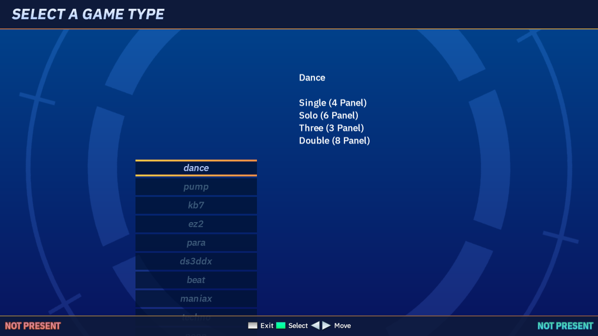
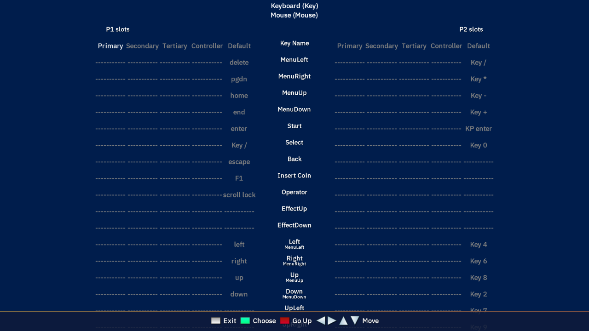
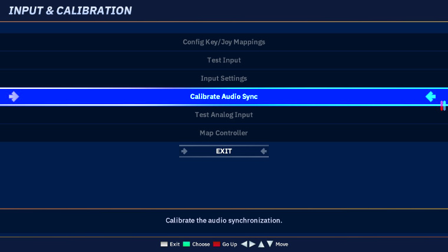
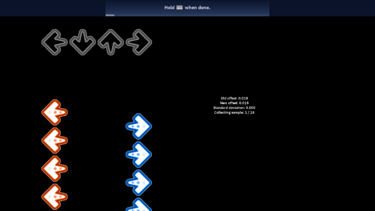
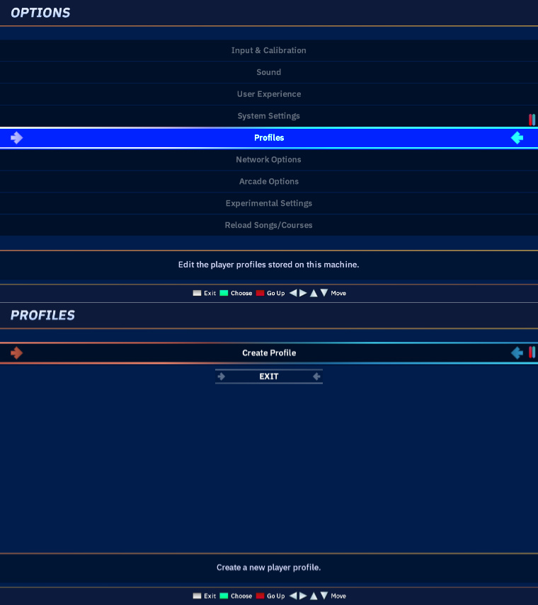

# First-time setup

To get the best experience, there are a few things you should do the first time you install Project OutFox. Some of these instructions assume use of the default theme Soundwaves.

## Selecting a game type

The first time you launch Project OutFox without save data present, you will be prompted to select which **game type** you would like to begin with. Project OutFox supports a variety of game types, which simulate different types of rhythm games (including button layouts and, where applicable, gameplay behaviours specific to the game type). Game types are further-divided into **styles**, which include chart types such as single, double, etc.

As of Alpha 4.9.7, they include:

* **dance** - the default game type. Similar to games such as _Dance Dance Revolution_ and _In the Groove_, it uses four lanes designated by cardinal directions (left, down, up, right).
* **pump** - a five-lane dance game, which uses four diagional directions and the center rather than cardinal directions.
* **kb7** - a seven-lane game type similar to games such as _o2Jam_, with six keys flanking a centre column (usually mapped by default to the SDF, JKL, and space keys by default)
* **ez2** - a game typed based on the defunct arcade game _ez2Dancer_, which uses three foot panels and a pair of hand sensors.
* **para** - a dance game designed for _para para_ routines, which is typically played with five infrared hand sensors in a semicircular layout, and uses a considerably looser scoring system.
* **ds3ddx** - a dance game whose format is common among Chinese arcade dance games, which uses four diagional foot panels, and four hand sensors around the pad in the cardinal directions.
* **beat** - a BMS player mode, supporting 5-key and 7-key styles, and the ability to load BMS files.
* **maniax** - a game typed based on the defunct arcade game _Dance ManiaX_, which uses four hand sensors arranged into two columns (upper and lower).
* **techno** - similar to ``dance``, except supporting up to eight panels (cardinal and diagional directions)
* **popn** - a PMS player mode, supporting 5-button and 9-button styles, and the ability to load PMS files.
* **gddm** - A drum mode supporting five-drum (with one bass pedal) and seven-drums (two pedals) styles, modelled upon the mechanics of the arcade rhythm game _DrumMania_.
* **guitar** - A guitar mode supporting three-button and five-button game types, modelled upon the mechanics of the arcade rhythm game _Guitar Freaks_.
* **kickbox** - A mode that was orignally designed for an exercise setup.

You can switch between them at any time using the "Select Game" button on the main menu.

## Configuring your controls

Each game type has its own default keyboard configuration; dance, for example, maps the first player to the arrow keys (when playing on keyboard, this is often referred to as the "index" playstyle). To configure your button mappings, go to **Options > Input & Calibration > Config Key/Joy Mappings**. 

Use the arrow keys to select an item to map, press Enter, and then press the button on the keyboard or controller you want to use. You can have multiple button assignments for each command.

Project OutFox supports a wide variety of controllers, and even arcade hardware. By default, the game operates with an XInput-compliant input engine. If your controller isn't detected correctly by the game but worked on StepMania 5.0/5.1, or doesn't perform as well, you can enable the alternate HIDAPI input mode from the **Experimental Options** menu.

## Calibrate your audio (Autosync)

In a rhythm game, timing is everything. But latency produced by your audio outputs can affect your accuracy. You can interactively adjust the audio **offset** using the **Calibrate Audio Sync** option in the **Input & Calibration** menu.

A song will play with a pattern of alternating notes; in the dance game type, they will be left and right arrows. Tap them to the rhythm **based on what you hear**. Every 24 notes, your inputs will be used to calculate a new offset; watch for "Perfect" and "Flawless" judgements.

The song will continue playing on a loop until you exit with the Back button (mapped to Escape by default), after which you will be given an opertunity to save the changes.

## Create a profile

While Project OutFox can save some data to a global "machine profile", it is recommended that you create a local profile so you can save personal high scores, as well as player settings (such as modifiers) that can persist between sessions.

You coan manage profiles from **Options > Profiles**. From here you can create a profile, and edit existing profiles.

From the profile editor (highlight a profile and press Start, and then select "Edit profile"), you can input fitness-related information, change the layout of the optional "Detailed Stats" pane during gameplay, and add an avatar to your profile (avatars are loaded from the Appearance/Avatars directory).

